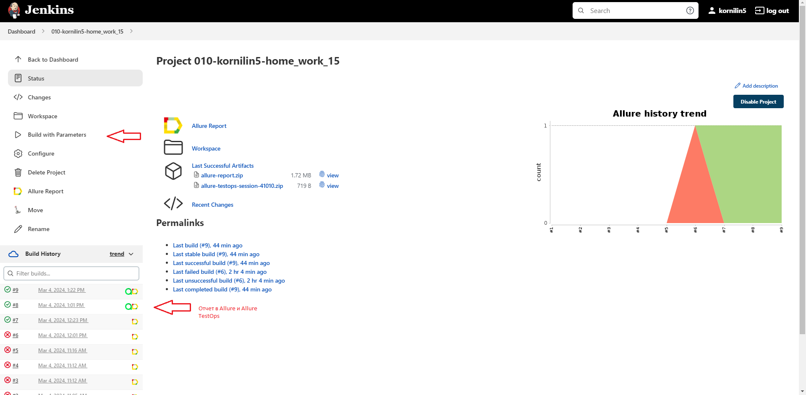
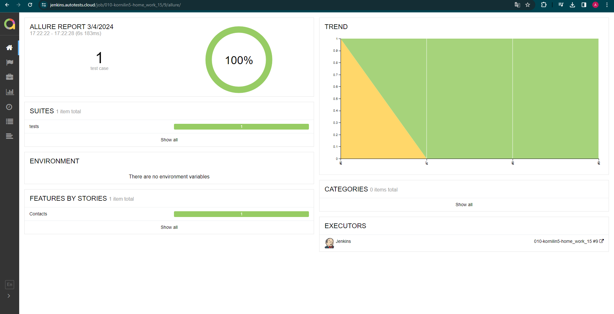
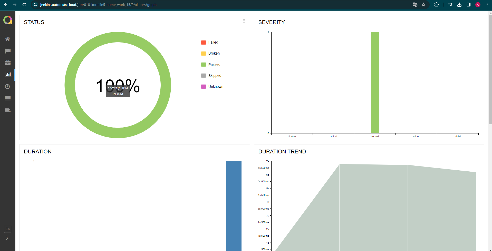
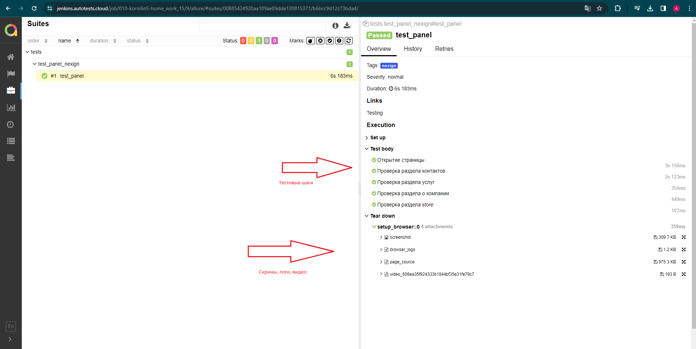
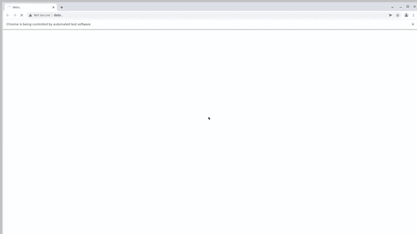
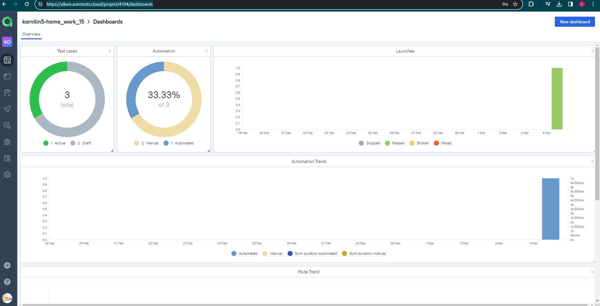
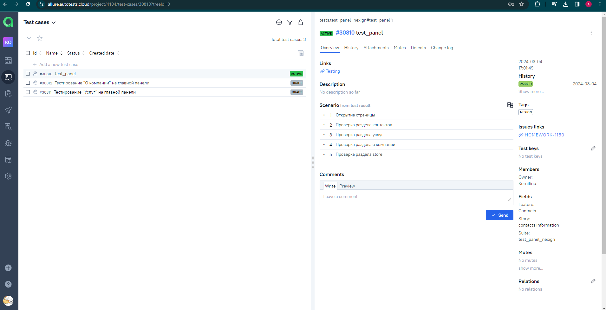
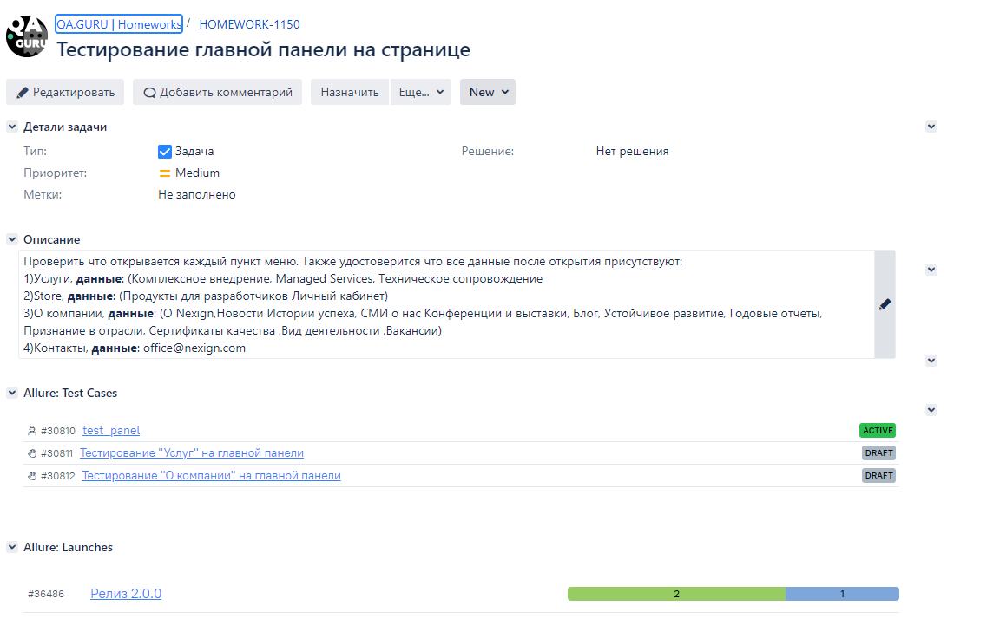
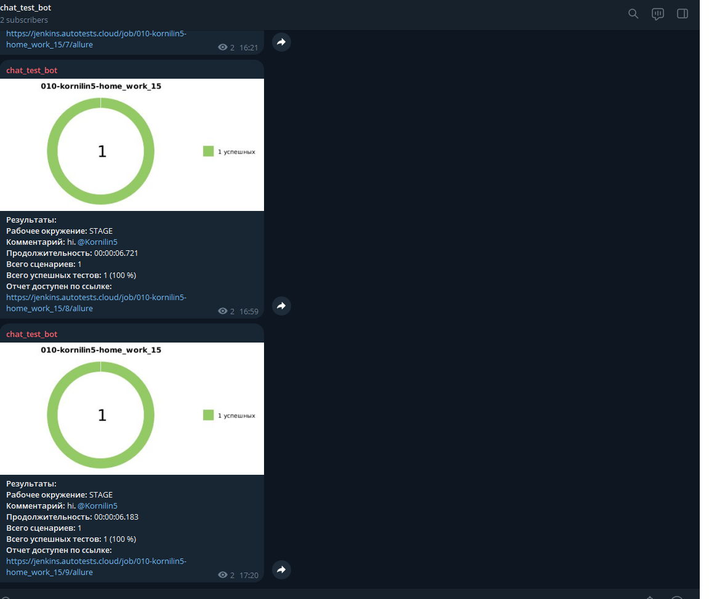

## Проект UI автотестов Nexign

<!-- Технологии -->

### Используемые технологии

  <code></code>
  <code></code>
  <code></code>
  <code></code>
  <code></code>
  <code></code>
  <code></code>
  <code></code>
  <code></code>
  <code></code>
  <code></code>
  <code></code>
  <code></code>
  <code></code>

<!-- Тест кейсы -->

### Что проверяем
* Открытие пункта "услуги" из главной панели 
* Открытие пункта "о компании" из главной панели 
* Открытие пункта "store" из главной панели 
* Открытие пункта "Контакты" из главной панели 

<!-- Jenkins -->

###  Запуск проекта в Jenkins

### [Задача в jenkins](https://jenkins.autotests.cloud/job/010-kornilin5-home_work_15/)

##### При нажатии на "Build with parameters" появится выбор для стенда, послего чего начнется сборка тестов и их прохождение, через виртуальную машину в Selenide.

<!-- Allure report -->

###  Allure report

``##### После прохождения тестов, результаты можно посмотреть в Allure отчете, где так же содержится ссылка на Jenkins

##### Во вкладке Graphs можно посмотреть графики о прохождении тестов, по их приоритезации, по времени прохождения и др.

##### Во вкладке Suites находятся собранные тест кейсы, у которых описаны шаги и приложены логи, скриншот и видео о прохождении теста

##### Видео прохождение теста

<!-- Allure TestOps -->

###  Интеграция с Allure TestOps

### [Dashboard](https://allure.autotests.cloud/project/4104/dashboards)

##### Так же вся отчетность сохраняется в Allure TestOps, где строятся аналогичные графики.

#### Во вкладке со сьютами, мы можем:
- Управлять всеми тест-кейсами или с каждым отдельно
- Перезапускать каждый тест отдельно от всех тестов
- Настроить интеграцию с Jira
- Добавлять ручные тесты и т.д

<!-- Jira -->

###  Интеграция с Jira
##### Настроив через Allure TestOps интеграцию с Jira, в тикет можно пробросить результат прохождение тестов и список тест-кейсов из Allure

<!-- Telegram -->

###  Интеграция с Telegram
##### После прохождения тестов, в Telegram bot приходит сообщение с графиком и небольшой информацией о тестах.

